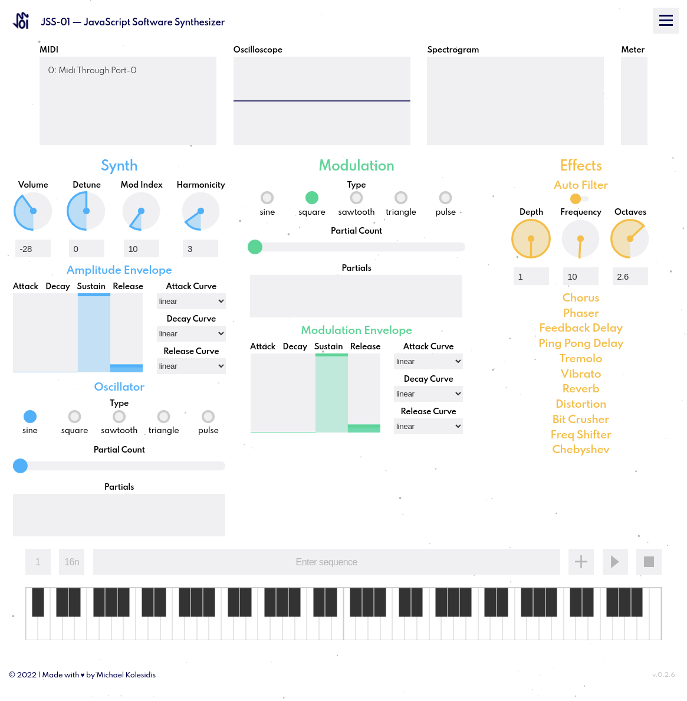
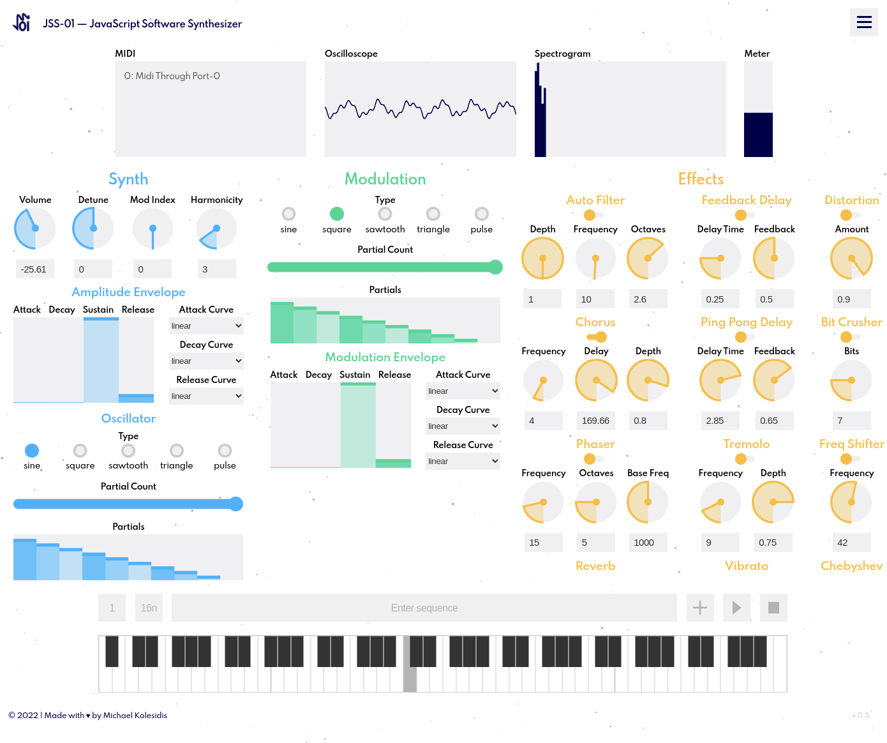
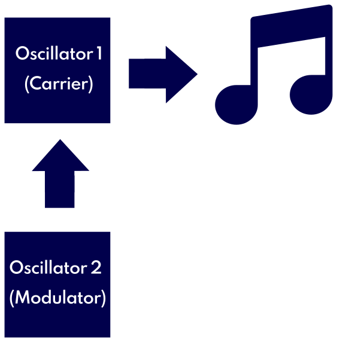
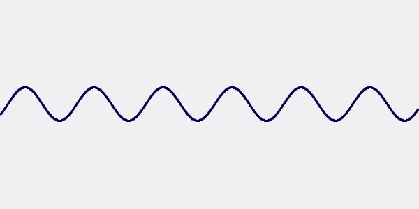
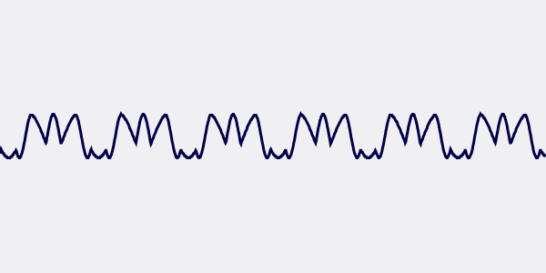
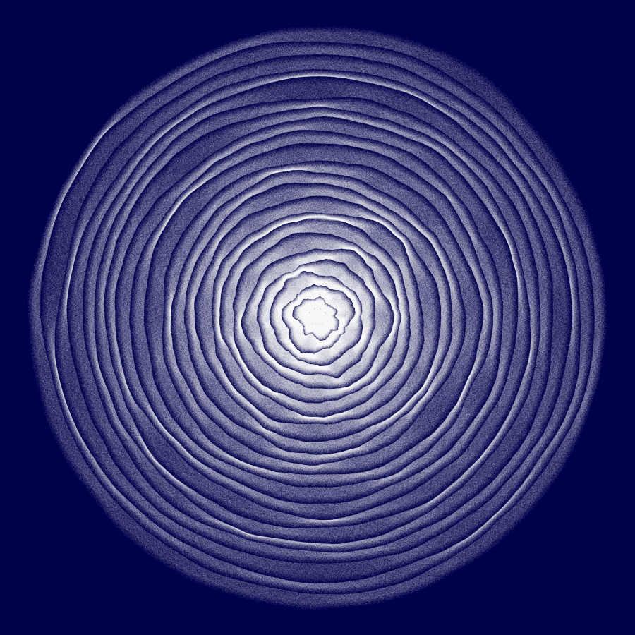

<h1 align="center">JSS-01 JavaScript Software Synthesizer</h1>

The JSS-01 | JavaScript Software Synthesizer is a web app enabling you to make and play music in the browser. It is a software synthesizer implementing a variety of JavaScript frameworks and libraries, such as Tone.js and NexusUI.

  
  

# Introduction
Keys, knobs, sliders and buttons to tweak your sound and generate immersive soundscapes. You can also connect your MIDI keyboard and play with it!

### Quick Start

The JSS-01 | JavaScript Software Synthesizer uses <strong>FM Synthesis</strong> (frequency modulation synthesis). In FM Synthesis there is an oscillator that produces the sound signal, the <strong>Carrier</strong>, and an oscillator that modulates the carrier's wave frequency, the <strong>Modulator</strong>.
  

 

<strong>Sine wave:</strong>

 

<strong>Frequency-modulated sine wave:</strong>

  

In JSS-01, the <strong>Synth Section</strong> of the synthesizer includes the controls for the <strong>Carrier</strong> oscillator.

  

The <strong>Modulation Section</strong> includes the controls for the <strong>Modulator</strong> oscillator. 

  

The <strong>Effects Section</strong> includes the controls of the various effects that can be applied to the sound.

  

#### How to Play

You can play the JSS-01 by using the on-screen keyboard, your computer keyboard, or a MIDI keyboard.

  

#### Oscilloscope
The <strong>Oscilloscope</strong> shows the waveform of the sound. You can click on it to pause or you can right-click on it to save the current waveform as an image.

  

#### Modulation Index

The Modulation Index determines the amount of the modulation that will be applied to the Carrier. If you set the <strong>Modulation Index</strong> to 0 (can be found at the top line of the Synth section) you get the unmodulated output of the carrier oscillator.

  

#### Sequencer

Right above the on-screen keyboard you can find the <strong>Sequencer</strong>. There is an included sequence preinstalled, so you can just press the <strong>Play button</strong> and listen to it. 
 
The first input from the left controls the rate of the sequence (speed). The second input is the base value of the notes of the sequence (16n stands for a 16th note value, 8n for an 8th and so on). You can input your own sequences in the main input by writing the sequence of the desired notes in this form: <strong>"C4", "F5", "D2"**</strong>. You can include parts with notes of half the base value by including them in brackets, ex. <strong>"C4", ["F5", "D2"]</strong>. In this examples, if the base value is 16n (16th notes), C4 will have a value of 16th, and each of the F5 and D2 will have a value of 32th (or a value of a 16th combined). 
 
When your sequence is ready, you can add it to the sequencer using the <strong>Add button</strong>. In order to go back to the default sequence, you can simply write <strong>default</strong> in the sequence input field and then click the Add button. There are two extra sequences included, the bassline of "I Feel Love" by Donna Summer (peoduced by Giorgio Moroder), which can be accessed by writing <strong>i feel love</strong> in the sequence input field and then pressing the add button, and the riff of "Funky Town", that can be accessed by writing <strong>funky town</strong>.

 

You can find some more information about the JSS-01 and sound synthesis in this short [presentation](./assets/presentation/JSS%20Presentation.pdf).

  

### System Requirments
The JSS-01 | JavaScript Software Synthesizer is quite heavy, especially on the CPU. We would suggest these indicative minimum requirments:

 

| Component     | Requirment |
| ------------- | -------------------------------- |
| CPU           | Quad-core x86-64 (2017 or later) |
| RAM           | 8GB                              |
| Display       | at least 1600x900                |

# Documentation
Will be released with version 1.0.0. In the meantime, you can refer to the [Tone.js documentation](https://tonejs.github.io/docs/).

# Guides & Tutorials
There aren't any guides and tutorials specifically for the JSS-01 yet, but there are plenty of excellent guides on the types of sound synthesis that the JSS-01 is using:

(Currently JSS-01 only has an FM mode implementing the FMSynth of Tone.js)

### FM Synthesis
* [Synth Secrets: An Introduction To Frequency Modulation from Sound on Sound](https://web.archive.org/web/20160403123704/http://www.soundonsound.com/sos/apr00/articles/synthsecrets.htm)
* [Synth Secrets: More On Frequency Modulation from Sound on Sound](https://web.archive.org/web/20160404062919/http://www.soundonsound.com/sos/may00/articles/synth.htm)
* [FM Synthesis Collection by Yamaha](https://www.yamahasynth.com/learn/synth-programming/fm-synthesis-collection)
* [FM Synthesis entry in Wikipedia](https://en.wikipedia.org/wiki/Frequency_modulation_synthesis)

# Contributing
Feel free to submit issues and pull requests. It would be great to create a community around JSS-01, to contiue its development and evolution, making it more capable and easier to use, increasing its creative and artistic potential.
If you are interested in becoming part of out community it would be useful to have a look to our dedicated document regarding [Contributing](https://github.com/michaelkolesidis/javascript-software-synthesizer/blob/main/CONTRIBUTING.md), as well as, out [Code of Conduct](https://github.com/michaelkolesidis/javascript-software-synthesizer/blob/main/CODE_OF_CONDUCT.md). It a nutshell, we want our community to be a safe space for everyone, so that we can all have a pleasant and joyful experience!

# Changelog
Please refer to the project's [Changelog](https://github.com/michaelkolesidis/javascript-software-synthesizer/blob/main/CHANGELOG.md) document.

# Technologies Used
* [Tone.js](https://github.com/Tonejs/Tone.js/)
 One  could say that Tone.js is the "soul" of our project. It provides us with the synthesizers we use to generate sounds, as well as their various properties that can be tweaked and adjusted.
* [NexusUI](https://github.com/nexus-js/ui)
 NexusUI provides us with the UI components that are connected to the synthesizers and make parameters adjusting easy and playful.
* [WEBMIDI.js](https://github.com/djipco/webmidi)
 WEBMIDI.js makes Web MIDI API easy to implement. It allows users to connect their MIDI keyboards and play the synthesizer the way it is meant to be played. Because, who likes playing music with a [mouse](https://web.archive.org/web/20150928202135im_/https://kathytemean.files.wordpress.com/2014/11/46289.jpg?w=500&h=540)?
* [p5.js](https://p5js.org/)
 p5.js is a JavaScript library for creative coding, with a focus on making coding accessible and inclusive for artists, designers, educators, beginners, and anyone else! We use it for the background animation.
* [Floating UI](https://github.com/floating-ui/floating-ui)
 Floating UI allows us to provide help to our users, by position floating tooltips, while intelligently keeping them in view.
* [Sass](https://github.com/sass/sass)
 The SCSS (Sassy CSS) syntax is utilized for the styling of our project.
* [npm](https://github.com/npm/cli)
 Our beloved package manager.

# Roadmap
Some of the ideas are full modular design, full compatibility with MIDI controllers, implementation of all Tone.js features, and in the (very) distant future even our own synth engines along with Tone.js.

# References and Inspiration
* [Synth Secrets from Sound on Sound](https://www.soundonsound.com/series/synth-secrets-sound-sound)
* [Learning Synths by Ableton](https://learningsynths.ableton.com/en/playground)
* [Syntorial](https://www.syntorial.com/)
* [Dexed - FM Plugin Synth](https://github.com/asb2m10/dexed)
* [Teenage Engineering OP-1](https://teenage.engineering/products/op-1)
* [Helm](https://tytel.org/helm/)

A full(-ish) list of references can be found in the [References](https://github.com/michaelkolesidis/javascript-software-synthesizer/blob/main/REFERENCES.md) document.

# License
Copyright (c) 2022 Michael Kolesidis 
Licensed under the [MIT License](https://opensource.org/licenses/MIT).

# Sponsors
None, yet! We will have to add way more features for that.

# Contributors
You name could be here and it would be great to have you aboard!

# Special Thanks To
* [Mohammed Amine Grid](https://github.com/mohammed-amine-grid), for his guidance and dedication throughout this journey.
* All the students and the tutors at the [Social Hackers Academy](https://github.com/SocialHackersAcademy), for creating a nice little community of passionate people offering their best for each other.
 
 

